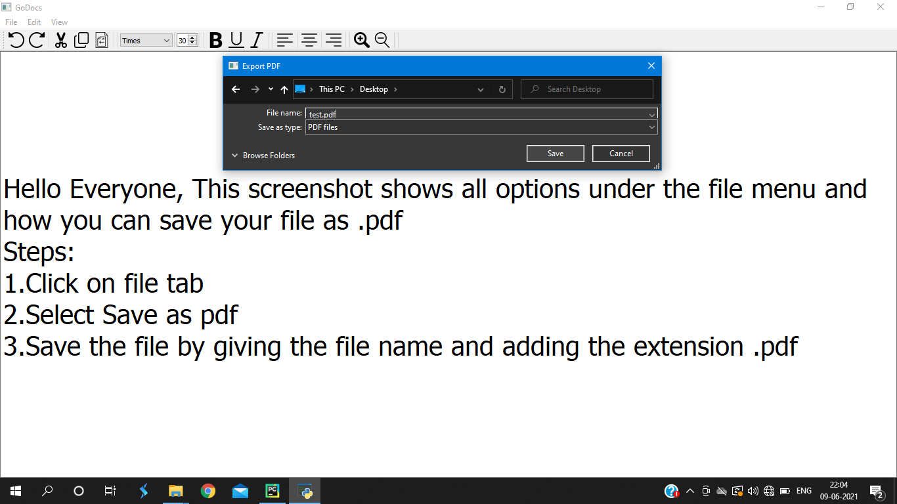

# Text-editor
A simple text-editor containing basic commands that allows us to write text documents

# Description
This is a text-editor similar to notepad, built using python that contains three tabs in the menu-bar: File, Edit, View and many options in the Toolbar to help the user
to customize their documents and after creating the document people can save them either as a pdf(.pdf) or as a text(.text) file.
To use the text-editor, just run the python code(in GoDocs.py) in your local computer and the application will start.
Just before executing the code, write these commands in the terminal: 
pip install pyqt5 
pip install docx2txt

# UI of the application
</img>

# Left, Center and Right align applied on text
</img>

# Bold, Underline and Italics applied on text
</img>

# Displaying all options under files tab
</img>

# Saving the file as PDF
</img>

# Saving the file as text document
</img>

# Displaying all options under edit tab
</img>

# Displaying all options under view tab with Normal mode selected
</img>
